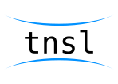

</img>

# tnsl-lang
This is the base repository for the tnsl language, and includes the standard compiler implementation, specification, and libtnsl implementation.  The specification and compiler are licenced under the CDDL-1.0 ([LICENCE.md](./LICENCE.md)), while libtnsl is dual-licenced under both the CDDL-1.0 ([LICENCE.md](./LICENCE.md)) and BSD-3-Clause ([LICENCE-BSD3.md](./libtnsl/LICENCE-BSD3.md)).

## tnsl specification

Under the folder `spec` is the [TNSL language specification](./spec/README.md).  It has been broken up into chapters in markdown format.  Any sub-folders are details on other related projects such as [libtnsl](./spec/libtnsl/README.md) (the standard library) and [tnslc](./spec/tnslc/README.md) (the default compiler).

	Current specification version:
	0.0.1

## libtnsl

An implimentation of the TNSL standard library.  Dual licenced under the CDDL 1.0 and BSD 3-clause licences.

	Current focused portions of libtnsl (in order of importance):
	- Type reflection and implimentation
	- Stream operations (file, io, etc.)
	- Basic data containers

## tnslc

The standard TNSL compiler suite.  Contains a universal front end for producing ASTs and multiple backends for seperate ISAs.

	Focused ISAs at this time (in order of importance):
	- x86
	- arm64
	- risc-v

## notice

Until the go based interpereter is done, some code may not be correct TNSL code to account for inconsistancies in the bootstrap interpereter.  However, the code shouldn't be too far from normal TNSL, the only real difference should be import statements, which will be fixed after the compiler can compile itself.

It is reccommended that if you are going to clone this repository and attempt to run anything within, first you should clone the latest version of [the interpreter](https://github.com/CircleShift/tnsl-parse) and build it.  Place the tint binary in this directory.

## Status

	Specification:    incomplete
	libtnsl:          incomplete
	tnslc:            incomplete

## Credits

	Copyright 2021 Kyle Gunger

	This file is licensed under the CDDL 1.0 (the License)
	and may only be used in accordance with the License.
	You should have received a copy of the License with this
	software/source code. If you did not, a copy can be found
	at the following URL:

	https://opensource.org/licenses/CDDL-1.0

	THIS SOFTWARE/SOURCE CODE IS PROVIDED "AS IS" WITH NO
	WARRANTY, GUARANTEE, OR CLAIM OF FITNESS FOR ANY PURPOSE
	EXPRESS OR IMPLIED.  PLEASE SEE THE LICENCE FOR LIMITATIONS
	AND PERMISSIONS UNDER THE LAW.